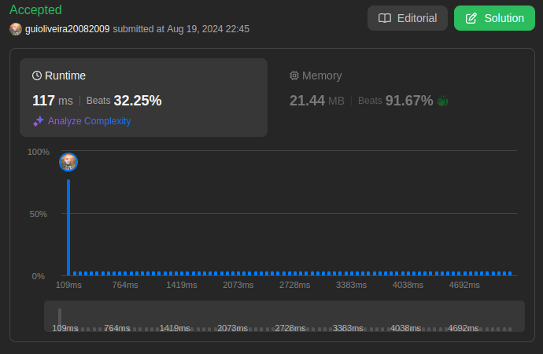
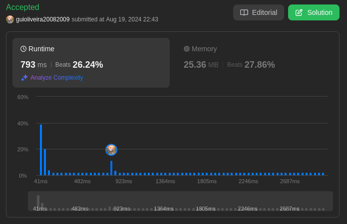
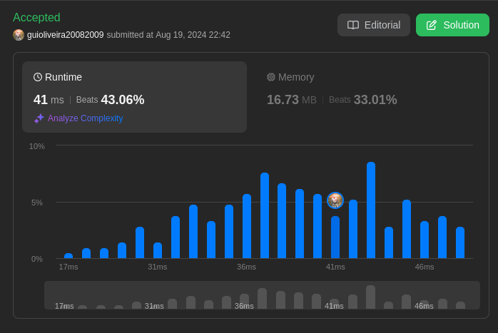

# LeetCode Problems

**Número da Lista**: 17  
**Conteúdo da Disciplina**: D&C 

## Aluno
|Matrícula | Aluno |
| -- | -- |
| 18/0113496  |  Guilherme de Oliveira Mendes |

## Sobre 
Neste projeto, será abordado alguns problemas disponíveis na plataforma [LeetCode](https://leetcode.com/) sobre algoritmos de dividir e conquistar. Sendo que os problemas apresentados serão resolvidos utilizando conceitos apredidos em sala de aula.

## Screenshots
[Difícil: 493. Reverse Pairs](https://leetcode.com/problems/reverse-pairs/description/) 

[Difícil: 218. The Skyline Problem ](https://leetcode.com/problems/the-skyline-problem/description/) 

[Média: 395. Longest Substring with At Least K Repeating Characters](https://leetcode.com/problems/longest-substring-with-at-least-k-repeating-characters/description/) 

[Média: 932. Beautiful Array ](https://leetcode.com/problems/beautiful-array/description/) 

## Instalação 
**Linguagem**: Python3    
**Framework**: Não 
**Pré-requisito**: Compilador de Python3.

## Link da Apresentação
[Apresentação PA 17 - LeetCode Problems - Dividir e Conquistar]() 
